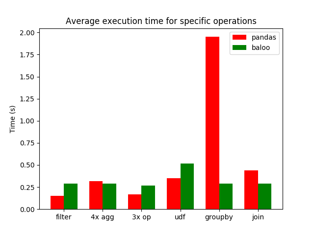
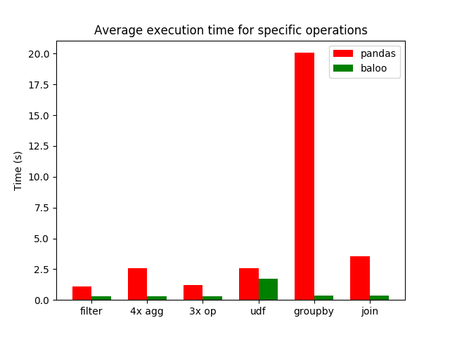

# Baloo

Implementing the [*bare necessities*](https://www.youtube.com/watch?v=08NlhjpVFsU) 
of [Pandas](https://pandas.pydata.org/) with the *lazy* evaluating
and optimizing [Weld](https://github.com/weld-project/weld) framework.

### Documentation [here](https://radujica.github.io/baloo/)

## Install
    pip install baloo
    
Note that currently it has only been tested on Python 3.5.2, though any Python 3 version should be fine.

## Benchmarks
Benchmark results over seeded randomized data are shown below. 
The data consists of 4 NumPy array columns: 2 of float64, 1 of int64, and 1 of int32.
First 2 plots run the following operations over 56MB and 420MB total data, respectively:

    df = df[(df['col1'] > 0) & (df['col2'] >= 10) & (df['col3'] < 30)]              # filter                                                   
    df = df.agg(['min', 'prod', 'mean', 'std'])                                     # 4x agg
    df['col4'] = df['col1'] * 2 + 1 - 23                                            # 3x op
    df['col5'] = df['col1'].apply(np.exp)                                           # udf
    df = df.groupby(['col2', 'col4']).var()                                         # groupby*
    df = df[['col3', 'col1']].join(df[['col3', 'col2']], on='col3', rsuffix='_r')   # join*
    
\* Note that the groupby and join implementations are simplified in Baloo. For instance, the groupby result is not sorted
in Baloo as is in Pandas. The join implementation in Baloo currently relies on the `on` data being sorted and distinct;
sortednes is expected to be patched soon.

This last graph shows the execution time of `3x op` over varying dataset sizes:

Weld is, indeed, expected to scale well due to features such as vectorization, however the compilation time outweighs
the improved computation time for small datasets. Nevertheless, Baloo currently only supports a limited subset of
Pandas. More work coming soon!

The scripts used to run the benchmarks are available in the relevant folder.
