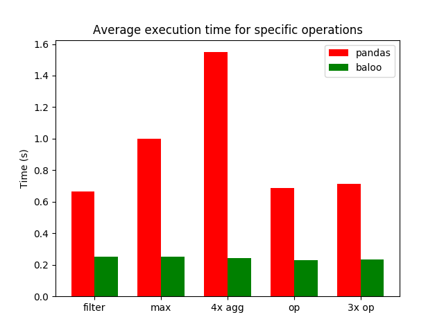
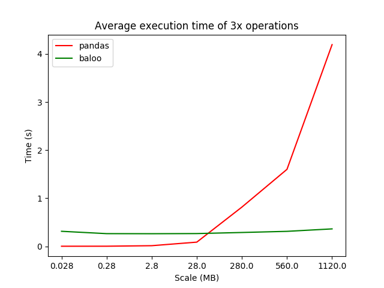

# Baloo

Implementing the [*bare necessities*](https://www.youtube.com/watch?v=08NlhjpVFsU) 
of [Pandas](https://pandas.pydata.org/) with the *lazy* evaluating
and optimizing [Weld](https://github.com/weld-project/weld) framework.

## Benchmarks
Preliminary benchmark results over seeded randomized data are shown below. 
The generated data consists of 4 columns of different numerical types, each a NumPy array of different numerical types. 
For the first plot, the data is 280MB in total. 
The operations are:

    df = df[(df['col1'] > 0) & (df['col2'] >= 10) & (df['col3'] < 30)]  # filter
    df = df.max()                                                       # max
    df = df.agg(['min', 'prod', 'mean', 'std'])                         # 4x agg
    df['col4'] = df['col1'] * 2                                         # op
    df['col4'] = df['col1'] * 2 + 1 - 23                                # 3x op
    

Weld is, indeed, expected to scale well due to features such as vectorization, however the compilation time outweighs
the improved computation time for small datasets. Nevertheless, Baloo currently only supports a very limited subset of
Pandas. More work coming soon!

## Install
    pip install baloo
    
Note that currently it has only tested on Python 3.5.2.
